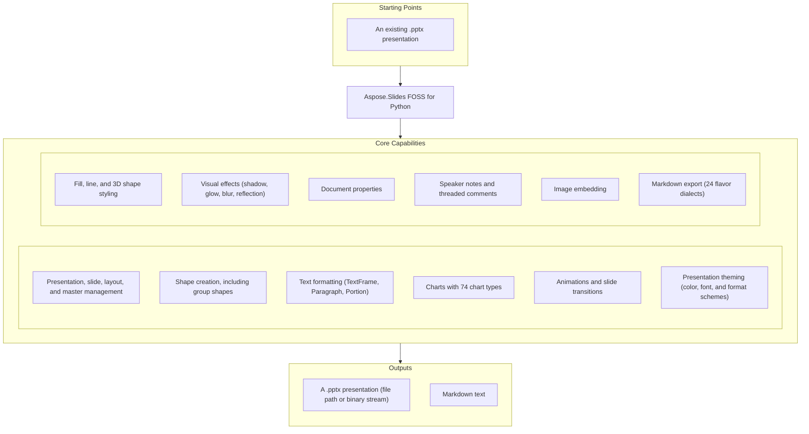

# Aspose.Slides FOSS for Python

[](https://pypi.org/project/aspose-slides-foss/) [](https://pypi.org/project/aspose-slides-foss/) [](LICENSE) [](https://github.com/aspose-slides-foss/Aspose.Slides-FOSS-for-Python/graphs/contributors)

[](https://products.aspose.org/slides/python/)

Aspose.Slides FOSS for Python is the official open-source Python library by Aspose.Slides for
creating, reading, and editing PowerPoint `.pptx` presentations. It models a presentation the way
PowerPoint itself does — `Presentation`, `Slide`, `Shape`, `TextFrame` — so slides, shapes, and
text feel native to work with, with no Microsoft Office installation or COM interop required.

## Navigation

- [At a Glance](#at-a-glance)
- [Key Capabilities](#key-capabilities)
- [Installation](#installation)
- [Quick Start](#quick-start)
- [Additional Examples](#additional-examples)
- [API Reference](#api-reference)
- [Documentation & Resources](#documentation--resources)
- [Scope and Limitations](#scope-and-limitations)
- [Development and Testing](#development-and-testing)
- [License](#license)

## At a Glance



## Key Capabilities

- Open, create, and save presentations through `Presentation`, always as a context manager
  (`with slides.Presentation(...) as prs:`) so the underlying package is disposed correctly. Save
  to `.pptx` (the default) or the related `.pptm`, `.ppsx`, `.ppsm`, `.potx`, and `.potm` Office
  Open XML variants through `SaveFormat`; unknown XML parts encountered on load are preserved
  verbatim on save, so round-tripping never silently drops content this library doesn't yet
  understand.
- Manage slides with `SlideCollection` (`add_empty_slide()`, `remove_at()`, `add_clone()`) and
  `Slide` / `LayoutSlide` / `MasterSlide`, including per-slide visibility (`slide.hidden`) and
  layout/master relationships.
- Add and position shapes — AutoShapes, PictureFrames, Tables, Connectors, and GroupShapes —
  through `ShapeCollection`, via `add_auto_shape()`, `add_table()`, `add_connector()`,
  `add_group_shape()`, and `add_picture_frame()`.
- Format text at the character, paragraph, and frame level with `TextFrame`, `Paragraph`, and
  `Portion`, including bullet formatting through `BulletFormat` and tri-state boolean properties
  (`font_bold`, `font_italic`) via `NullableBool`.
- Build charts with 74 chart types via `ChartType`, backed by an embedded `ChartDataWorkbook` for
  series and category data, plus trendlines, error bars, legends, titles, data labels, and
  markers.
- Animate slides and shapes with animation sequences and effects (`Sequence`, `Effect`, created
  through `BehaviorFactory`) — triggers, timing, and motion paths via `MotionPath` /
  `MotionCmdPath`.
- Apply any of 57 `TransitionType` slide transitions, including `MorphTransition`, with per-slide
  advance and timing settings through `slide.slide_show_transition`.
- Style shapes and slide backgrounds with solid, gradient, pattern, and picture fills through
  `FillFormat` / `FillType`; style lines (width, dash style, cap/join style, alignment, and
  arrowheads)
  through `LineFormat`; and apply shape effects — outer shadow, inner shadow, glow, blur,
  reflection, and soft edge — through `EffectFormat` (`OuterShadow`, `InnerShadow`, `Glow`,
  `Blur`, `Reflection`, `SoftEdge`).
- Manage presentation themes through `Theme` (reached via `prs.master_theme`) — color schemes
  (`ColorScheme`: dark/light/accent1-6/hyperlink colors), font schemes (`FontScheme`: major/minor
  font collections), and format schemes (`FormatScheme`: fill, line, effect, and background-fill
  styles) — and override individual master themes with `MasterThemeManager` (`override_theme`,
  `is_override_theme_enabled`).
- Add 3D formatting — bevel, camera, light rig, material, and extrusion depth — through
  `ThreeDFormat`, `Camera`, and `LightRig`.
- Read and write presentation metadata with `DocumentProperties` (core, app, and custom
  properties via `set_custom_property_value()`), add per-slide speaker notes with header and
  footer visibility management through `NotesSlideManager` / `NotesSlideHeaderFooterManager`, and
  manage threaded comments — authors, timestamps, and positions — with `CommentAuthorCollection`
  / `CommentCollection`.
- Embed images from a file, bytes, or stream with `Images.from_file()` / `Images.from_stream()`,
  or add one directly to a slide with `ImageCollection.add_image()`.
- Export presentation text to Markdown in 24 flavor dialects through `SaveFormat.MD` and
  `MarkdownSaveOptions`, carrying over text frames, tables, lists, headings, comments, and chart
  data.

## Installation

Install the library from PyPI:

```bash
pip install aspose-slides-foss
```

Requires Python 3.10 or later and depends only on `lxml` >= 4.9, installed automatically as a
dependency. Import the package as `aspose.slides_foss`:

```python
import aspose.slides_foss as slides
```

## Dependencies

### Required Package Dependencies

- `lxml` >= 4.9 — the XML/XPath library backing this project's OPC/OOXML parsing; installed
  automatically as a dependency.

### Development Dependencies

- `pytest` — the test framework used by this project's own test suite.

## Quick Start

Open an existing presentation, inspect it, and save a copy; then create a new one from scratch:

```python
import aspose.slides_foss as slides
from aspose.slides_foss.export import SaveFormat

# Open an existing presentation
with slides.Presentation("input.pptx") as prs:
    print(f"Slides: {len(prs.slides)}")
    prs.save("output.pptx", SaveFormat.PPTX)

# Create a new presentation
with slides.Presentation() as prs:
    slide = prs.slides[0]
    prs.save("new.pptx", SaveFormat.PPTX)
```

## Additional Examples

### Add a Shape With Text

```python
from aspose.slides_foss import ShapeType
import aspose.slides_foss as slides
from aspose.slides_foss.export import SaveFormat

with slides.Presentation() as prs:
    slide = prs.slides[0]
    shape = slide.shapes.add_auto_shape(ShapeType.RECTANGLE, 50, 50, 300, 100)
    shape.add_text_frame("Hello, world!")
    prs.save("shapes.pptx", SaveFormat.PPTX)
```

<details>
<summary>View Additional Examples</summary>

### Format Text

```python
from aspose.slides_foss import ShapeType, NullableBool, FillType
from aspose.slides_foss.drawing import Color
import aspose.slides_foss as slides
from aspose.slides_foss.export import SaveFormat

with slides.Presentation() as prs:
    shape = prs.slides[0].shapes.add_auto_shape(ShapeType.RECTANGLE, 50, 50, 400, 150)
    tf = shape.add_text_frame("Formatted text")
    fmt = tf.paragraphs[0].portions[0].portion_format
    fmt.font_height = 24
    fmt.font_bold = NullableBool.TRUE
    fmt.fill_format.fill_type = FillType.SOLID
    fmt.fill_format.solid_fill_color.color = Color.from_argb(255, 0, 70, 127)
    prs.save("text.pptx", SaveFormat.PPTX)
```

### Add a Table

```python
import aspose.slides_foss as slides
from aspose.slides_foss.export import SaveFormat

with slides.Presentation() as prs:
    table = prs.slides[0].shapes.add_table(50, 50, [120.0, 120.0, 120.0], [40.0, 40.0])
    table.rows[0][0].text_frame.text = "Name"
    table.rows[0][1].text_frame.text = "Value"
    prs.save("table.pptx", SaveFormat.PPTX)
```

### Connect Two Shapes

```python
from aspose.slides_foss import ShapeType
import aspose.slides_foss as slides
from aspose.slides_foss.export import SaveFormat

with slides.Presentation() as prs:
    slide = prs.slides[0]
    box1 = slide.shapes.add_auto_shape(ShapeType.RECTANGLE, 50, 100, 150, 60)
    box2 = slide.shapes.add_auto_shape(ShapeType.RECTANGLE, 350, 100, 150, 60)
    conn = slide.shapes.add_connector(ShapeType.BENT_CONNECTOR3, 0, 0, 10, 10)
    conn.start_shape_connected_to = box1
    conn.start_shape_connection_site_index = 3  # right
    conn.end_shape_connected_to = box2
    conn.end_shape_connection_site_index = 1    # left
    prs.save("connector.pptx", SaveFormat.PPTX)
```

### Fill a Shape

```python
from aspose.slides_foss import ShapeType, FillType
from aspose.slides_foss.drawing import Color
import aspose.slides_foss as slides
from aspose.slides_foss.export import SaveFormat

with slides.Presentation() as prs:
    shape = prs.slides[0].shapes.add_auto_shape(ShapeType.RECTANGLE, 50, 50, 300, 150)
    shape.fill_format.fill_type = FillType.SOLID
    shape.fill_format.solid_fill_color.color = Color.from_argb(255, 30, 120, 200)
    prs.save("fill.pptx", SaveFormat.PPTX)
```

### Add Speaker Notes

```python
import aspose.slides_foss as slides
from aspose.slides_foss.export import SaveFormat

with slides.Presentation() as prs:
    notes = prs.slides[0].notes_slide_manager.add_notes_slide()
    notes.notes_text_frame.text = "Speaker notes go here."
    prs.save("notes.pptx", SaveFormat.PPTX)
```

### Add a Threaded Comment

```python
from aspose.slides_foss.drawing import PointF
from datetime import datetime
import aspose.slides_foss as slides
from aspose.slides_foss.export import SaveFormat

with slides.Presentation() as prs:
    author = prs.comment_authors.add_author("Jane Smith", "JS")
    slide = prs.slides[0]
    author.comments.add_comment("Review this slide", slide, PointF(2.0, 2.0), datetime.now())
    prs.save("comments.pptx", SaveFormat.PPTX)
```

### Set Document Properties

```python
import aspose.slides_foss as slides
from aspose.slides_foss.export import SaveFormat

with slides.Presentation() as prs:
    prs.document_properties.title = "Q1 Results"
    prs.document_properties.author = "Finance Team"
    prs.document_properties.set_custom_property_value("Version", 3)
    prs.save("deck.pptx", SaveFormat.PPTX)
```

### Build a Chart From Scratch

Populate the chart's backing workbook to control series and category data directly:

```python
from aspose.slides_foss.charts import ChartType
import aspose.slides_foss as slides
from aspose.slides_foss.export import SaveFormat

with slides.Presentation() as prs:
    slide = prs.slides[0]

    # Pass has_default_data=False to start with an empty workbook
    chart = slide.shapes.add_chart(ChartType.CLUSTERED_COLUMN, 50, 50, 600, 400, False)
    chart.chart_title.add_text_frame_for_overriding("Quarterly Sales")

    cd = chart.chart_data
    wb = cd.chart_data_workbook  # embedded XLSX workbook backing the chart

    cd.series.clear()
    cd.categories.clear()

    # Workbook layout (worksheet 0):
    #          col 0   col 1      col 2
    #  row 0            "Revenue"  "Expenses"   <- series name row
    #  row 1   "Q1"     1200       800
    #  row 2   "Q2"     1500       900
    #  row 3   "Q3"     1800       1000
    #  row 4   "Q4"     2100       1100

    # Categories — column 0, rows 1..4
    for row, name in enumerate(["Q1", "Q2", "Q3", "Q4"], start=1):
        cd.categories.add(wb.get_cell(0, row, 0, name))

    # Series 1 (Revenue) — name at (row 0, col 1), values at (rows 1..4, col 1)
    s1 = cd.series.add(wb.get_cell(0, 0, 1, "Revenue"), chart.type)
    for row, value in enumerate([1200, 1500, 1800, 2100], start=1):
        s1.data_points.add_data_point_for_bar_series(wb.get_cell(0, row, 1, value))

    # Series 2 (Expenses) — name at (row 0, col 2), values at (rows 1..4, col 2)
    s2 = cd.series.add(wb.get_cell(0, 0, 2, "Expenses"), chart.type)
    for row, value in enumerate([800, 900, 1000, 1100], start=1):
        s2.data_points.add_data_point_for_bar_series(wb.get_cell(0, row, 2, value))

    prs.save("chart.pptx", SaveFormat.PPTX)
```

`wb.get_cell(worksheet_index, row, column, value)` writes the value to the embedded XLSX workbook
and returns a cell reference that the chart's series and categories bind to.

### Apply a Slide Transition

```python
from aspose.slides_foss.slideshow import TransitionType
import aspose.slides_foss as slides
from aspose.slides_foss.export import SaveFormat

with slides.Presentation() as prs:
    slide = prs.slides[0]
    slide.slide_show_transition.type = TransitionType.CIRCLE
    slide.slide_show_transition.advance_on_click = True
    slide.slide_show_transition.advance_after_time = 3000  # ms
    prs.save("transition.pptx", SaveFormat.PPTX)
```

### Group Shapes

```python
from aspose.slides_foss import ShapeType
import aspose.slides_foss as slides
from aspose.slides_foss.export import SaveFormat

with slides.Presentation() as prs:
    slide = prs.slides[0]
    group = slide.shapes.add_group_shape()
    group.shapes.add_auto_shape(ShapeType.RECTANGLE, 300, 100, 100, 100)
    group.shapes.add_auto_shape(ShapeType.RECTANGLE, 500, 100, 100, 100)
    group.name = "TwoRectangles"
    prs.save("group.pptx", SaveFormat.PPTX)
```

### Export to Markdown

```python
import aspose.slides_foss as slides
from aspose.slides_foss.export import SaveFormat, MarkdownSaveOptions, Flavor, NewLineType

with slides.Presentation("input.pptx") as prs:
    # Save the whole presentation with default options
    prs.save("output.md", SaveFormat.MD)

    # Or customize the output
    options = MarkdownSaveOptions()
    options.flavor = Flavor.GITHUB
    options.new_line_type = NewLineType.UNIX
    options.show_slide_number = True
    options.slide_number_format = "## Slide {0}"
    options.show_hidden_slides = True
    options.show_comments = True
    prs.save("custom.md", SaveFormat.MD, options)

    # Save only selected slides (1-based, order and repeats respected)
    prs.save("subset.md", [2, 1], SaveFormat.MD, options)
```

Text frames, tables, lists, titles/subtitles (as headings), comments, and chart data are
exported; the export is text-only, so images, media, and SmartArt are skipped.

</details>

## API Reference

The primary entry point is `Presentation`, which owns a `SlideCollection` of `Slide` objects,
each exposing its shapes through `Slide.shapes` (a `ShapeCollection`).

<details>
<summary>View the Core API Surface</summary>

### Core API

| Class | Description |
|---|---|
| `AdjustValue` | Represents a geometry shape's adjustment value. |
| `AdjustValueCollection` | Reprasents a collection of shape's adjustments. |
| `AutoShape` | Represents an AutoShape. |
| `Background` | Represents background of a slide. |
| `BaseHandoutNotesSlideHeaderFooterManager` | Common base class for the header/footer visibility managers shared by handout and notes slides. |
| `BasePortionFormat` | Common text portion formatting properties. |
| `BaseShapeLock` | Common base class for shape-specific lock settings, extended by `GroupShapeLock` and `PictureFrameLock`. |
| `BaseSlide` | Represents common data for all slide types. |
| `BulletFormat` | Represents paragraph bullet formatting properties. |
| `Camera` | Represents Camera. |
| `Cell` | Represents a cell of a table. |
| `CellCollection` | Represents a collection of cells. |
| `CellFormat` | Represents format of a table cell. |
| `ColorFormat` | Represents a color used in a presentation. |
| `Column` | Represents a column in a table. |
| `ColumnCollection` | Represents collection of columns in a table. |
| `Comment` | Represents a comment on a slide. |
| `CommentAuthor` | Represents an author of comments. |
| `CommentAuthorCollection` | Represents a collection of comment authors. |
| `CommentCollection` | Represents a collection of comments of one author. |
| `Connector` | Represents a connector. |
| `DocumentProperties` | Represents properties of a presentation. |
| `EffectFormat` | Represents effect properties of shape. |
| `FillFormat` | Represents a fill formatting options. |
| `FontData` | Represents a font definition. |
| `Fonts` | Fonts collection. |
| `GeometryShape` | Abstract base class for shapes with adjustable preset geometry, extended by `AutoShape` and `PictureFrame`. |
| `GlobalLayoutSlideCollection` | Represents a collection of all layout slides in presentation. |
| `GradientFormat` | Represent a gradient format. |
| `GradientStop` | Represents a gradient format. |
| `GradientStopCollection` | Represnts a collection of gradient stops. |
| `GraphicalObject` | Abstract base class for slide-embedded graphical objects that support placeholder association, locking, and custom data (extends `Shape`). |
| `GraphicalObjectLock` | Class extending BaseShapeLock. |
| `GroupShape` | Represents a group of shapes on a slide. |
| `GroupShapeLock` | Determines which operations are disabled on the parent GroupShape. |
| `HeadingPair` | Represents a 'Heading pair' property of the document. |
| `Image` | Represents a raster or vector image. |
| `ImageCollection` | Represents collection of PPImage. |
| `Images` | Methods to instantiate and work with . |
| `LayoutSlide` | Represents a layout slide. |
| `LayoutSlideCollection` | Represents a base class for collection of a layout slides. |
| `LightRig` | Represents LightRig. |
| `LineFillFormat` | Represents properties for lines filling. |
| `LineFormat` | Represents format of a line. |
| `MasterLayoutSlideCollection` | Represents a collections of all layout slides of defined master slide. |
| `MasterSlide` | Represents a master slide in a presentation. |
| `MasterSlideCollection` | Represents a collection of master slides. |
| `NotesSize` | Represents a size of notes slide. |
| `NotesSlide` | Represents a notes slide in a presentation. |
| `NotesSlideHeaderFooterManager` | Represents manager which holds behavior of the notes slide placeholders, including header placeholder. |
| `NotesSlideManager` | Notes slide manager. |
| `PPImage` | Represents an image in a presentation. |
| `PVIObject` | Encapsulates basic service infrastructure for objects can be a subject of property value inheritance. |
| `Paragraph` | Represents a paragraph of text. |
| `ParagraphCollection` | Represents a collection of a paragraphs. |
| `ParagraphFormat` | This class contains the paragraph formatting properties. |
| `PatternFormat` | Represents a pattern to fill a shape. |
| `Picture` | Represents a picture in a presentation. |
| `PictureFillFormat` | Represents a picture fill style. |
| `PictureFrame` | Represents a frame with a picture inside. |
| `PictureFrameLock` | Determines which operations are disabled on the parent PictureFrame. |
| `Portion` | Represents a portion of text inside a text paragraph. |
| `PortionCollection` | Represents a collection of portions. |
| `PortionFormat` | This class contains the text portion formatting properties. |
| `Presentation` | Represents a Microsoft PowerPoint presentation. |
| `Row` | Represents a row in a table. |
| `RowCollection` | Represents table row collection. |
| `Shape` | Represents a shape on a slide. |
| `ShapeBevel` | Contains the properties of shape's main face relief. |
| `ShapeCollection` | Represents a collection of shapes. |
| `ShapeFrame` | Represents shape frame's properties. |
| `Slide` | Represents a slide in a presentation. |
| `SlideCollection` | Represents a collection of a slides. |
| `Table` | Represents a table on a slide. |
| `TableFormat` | Represents format of a table. |
| `TextFrame` | Represents a TextFrame. |
| `TextFrameFormat` | Contains the TextFrame's formatTextFrameFormatting properties. |
| `ThreeDFormat` | Represents 3-D properties. |

#### Enumerations

| Enumeration | Description |
|---|---|
| `BackgroundType` | Defines the slide background fill source. |
| `BevelPresetType` | Constants which define 3D bevel of shape. |
| `BulletType` | Represents the type of the extended bullets. |
| `CameraPresetType` | Constants which define camera preset type. |
| `ColorType` | Represents different color modes. |
| `FillBlendMode` | Determines blend mode. |
| `FillType` | Specifies the interior fill type of various visual objects. |
| `FontAlignment` | Represents vertical font alignment. |
| `GradientDirection` | Represents the gradient style. |
| `GradientShape` | Represents the shape of gradient fill. |
| `LightRigPresetType` | Constants which define light preset types. |
| `LightingDirection` | Constants which define light directions. |
| `LineAlignment` | Represents the lines alignment type. |
| `LineArrowheadLength` | Represents the length of an arrowhead. |
| `LineArrowheadStyle` | Represents the style of an arrowhead. |
| `LineArrowheadWidth` | Represents the width of an arrowhead. |
| `LineCapStyle` | Represents the line cap style. |
| `LineDashStyle` | Represents the line dash style. |
| `LineJoinStyle` | Represents the lines join style. |
| `LineStyle` | Represents the style of a line. |
| `MaterialPresetType` | Constants which define material of shape. |
| `NullableBool` | Represents triple boolean values. |
| `NumberedBulletStyle` | Represents the style of the numbered bullets. |
| `Orientation` | Represents the orientation of a shape. |
| `PatternStyle` | Represents the pattern style. |
| `PictureFillMode` | Determines how picture will fill area. |
| `PresetColor` | Represents predefined color presets. |
| `PresetShadowType` | Represents a preset for a shadow effect. |
| `RectangleAlignment` | Defines 2-dimension allignment. |
| `SchemeColor` | Represents colors in a color scheme. |
| `ShapeType` | Represents preset geometry of geometry shapes. |
| `SlideLayoutType` | Represents the slide layout type. |
| `SourceFormat` | Represents source file format. |
| `TableStylePreset` | Represents builtin table styles. |
| `TextAlignment` | Represents different text alignment styles. |
| `TextAnchorType` | text box alignment within a text area. |
| `TextAutofitType` | Represents text autofit mode. |
| `TextCapType` | Represents the type of text capitalisation. |
| `TextShapeType` | Represents text wrapping shape. |
| `TextStrikethroughType` | Represents the type of text strikethrough. |
| `TextUnderlineType` | Represents the type of text underline. |
| `TextVerticalType` | Determines vertical writing mode for a text. |
| `TileFlip` | Defines tile flipping mode. |

---

### Animation

| Class | Description |
|---|---|
| `AnimationTimeLine` | Represents timeline of animation. |
| `Behavior` | Represent base class behavior of effect. |
| `BehaviorCollection` | Represents collection of behavior effects. |
| `BehaviorFactory` | Factory for creating behavior effect instances. |
| `BehaviorProperty` | Represent property types for animation behavior. |
| `BehaviorPropertyCollection` | Represents collection of behavior properties. |
| `ColorEffect` | Represent color effect behavior of effect. |
| `ColorOffset` | Represent color offset. |
| `CommandEffect` | Represent command effect behavior of effect. |
| `Effect` | Represents animation effect. |
| `FilterEffect` | Represent filter effect behavior of effect. |
| `MotionCmdPath` | Represent one command of a path. |
| `MotionEffect` | Represent motion effect behavior of effect. |
| `MotionPath` | Represent motion path. |
| `Point` | Represents animation point. |
| `PointCollection` | Represents a collection of animation points. |
| `PropertyEffect` | Represent property effect behavior of effect. |
| `RotationEffect` | Represent rotation effect behavior of effect. |
| `ScaleEffect` | Represent scale effect behavior of effect. |
| `Sequence` | Represents sequence (collection of effects). |
| `SequenceCollection` | Represents collection of interactive sequences. |
| `SetEffect` | Represent set effect behavior of effect. |
| `TextAnimation` | Represent text animation. |
| `TextAnimationCollection` | Represents collection of text animations. |
| `Timing` | Represents animation timing. |

#### Enumerations

| Enumeration | Description |
|---|---|
| `AfterAnimationType` | Represents the after animation type of an animation effect. |
| `AnimateTextType` | Represents the animate text type of an animation effect. |
| `BehaviorAccumulateType` | Represents types of accumulation of effect behaviors. |
| `BehaviorAdditiveType` | Represents additive type for effect behavior. |
| `BuildType` | Determines how text will appear on a shape during animation. |
| `ColorDirection` | Represents color direction for color effect behavior. |
| `ColorSpace` | Represents color space for color effect behavior. |
| `CommandEffectType` | Represents command effect type for command effect behavior. |
| `EffectChartMajorGroupingType` | Represents the type of an animation effect for chart's element. |
| `EffectChartMinorGroupingType` | Represents the type of an animation effect for chart's element in series or category. |
| `EffectFillType` | Represent fill types. |
| `EffectPresetClassType` | Represent effect class types. |
| `EffectRestartType` | Represent restart types for timing. |
| `EffectSubtype` | Represents subtypes of animation effect. |
| `EffectTriggerType` | Represent trigger type of effect. |
| `EffectType` | Represents the type of an animation effect. |
| `FilterEffectRevealType` | Represents filter reveal type. |
| `FilterEffectSubtype` | Represents filter effect subtypes. |
| `FilterEffectType` | Represents filter effect types. |
| `MotionCommandPathType` | Represent types of command for animation motion effect behavior. |
| `MotionOriginType` | Specifies what the origin of the motion path is relative to. |
| `MotionPathEditMode` | Specifies how the motion path moves when the target shape is moved. |
| `MotionPathPointsType` | Represent types of points in animation motion path. |
| `PropertyCalcModeType` | Represent calc mode for animation property. |
| `PropertyValueType` | Represent property value types. |

---

### Charts

| Class | Description |
|---|---|
| `AxesManager` | Provides access to chart axes. |
| `Axis` | Encapsulates the object that represents a chart's axis. |
| `BaseChartValue` | Base class for chart value types. |
| `Chart` | Represents a chart on a slide. |
| `ChartCategory` | Represents a chart category. |
| `ChartCategoryCollection` | Represents collection of chart categories. |
| `ChartData` | Represents data used for chart plotting. |
| `ChartDataCell` | Represents a cell in the chart data workbook. |
| `ChartDataPoint` | Represents a series data point. |
| `ChartDataPointCollection` | Represents collection of data points for a series. |
| `ChartDataWorkbook` | Provides access to the embedded Excel workbook for chart data. |
| `ChartDataWorksheet` | Represents a worksheet in the chart data workbook. |
| `ChartLinesFormat` | Represents gridlines format properties. |
| `ChartPlotArea` | Represents rectangle where chart should be plotted. |
| `ChartPortionFormat` | Chart portion formatting — wraps `<a:defRPr>` inside `<c:txPr>`. |
| `ChartSeries` | Represents a chart series. |
| `ChartSeriesCollection` | Represents collection of chart series. |
| `ChartSeriesGroup` | Represents group of series. |
| `ChartSeriesGroupCollection` | Collection of ChartSeriesGroup objects. |
| `ChartSeriesReadonlyCollection` | Readonly view of chart series belonging to a single series group. |
| `ChartTextFormat` | Specifies default text formatting for chart text elements. |
| `ChartTitle` | Represents chart title properties. |
| `ChartWall` | Represents walls on 3D charts. |
| `DataLabel` | Represents a series data point label. |
| `DataLabelCollection` | Represents the labels of a chart series. |
| `DataLabelFormat` | Represents formatting options for DataLabel. |
| `DataSourceTypeForErrorBarsCustomValues` | Specifies types of values in ChartDataPoint.ErrorBarsCustomValues properties list. |
| `DataTable` | Represents data table properties. |
| `DoubleChartValue` | Represents a double value backed by a workbook cell or literal. |
| `ErrorBarsCustomValues` | Specifies the error bar values for a single data point. |
| `ErrorBarsFormat` | Represents error bars of chart series. |
| `Format` | Represents chart format properties (fill, line, effect, 3D). |
| `Legend` | Represents chart's legend properties. |
| `LegendEntryCollection` | Collection of legend entries. |
| `LegendEntryProperties` | Represents legend properties of a chart entry. |
| `Marker` | Represents a chart marker (symbol at data points). |
| `Rotation3D` | Represents 3D rotation of a chart. |
| `StringChartValue` | Represents a string value backed by workbook cells or literal. |
| `StringOrDoubleChartValue` | Represents a value that can be string or double, backed by a cell or literal. |
| `Trendline` | Represents a trend line of a chart series. |
| `TrendlineCollection` | Represents a collection of Trendline objects for a chart series. |

#### Enumerations

| Enumeration | Description |
|---|---|
| `AxisPositionType` | Determines a position of axis. |
| `BubbleSizeRepresentationType` | Specifies the possible ways to represent data as bubble chart sizes. |
| `CategoryAxisType` | Represents a type of a category axis. |
| `ChartDataSourceType` | Represents a type of data source of the chart. |
| `ChartType` | Represents a type of chart. |
| `CombinableSeriesTypesGroup` | Enumeration of groups of combinable series types. |
| `CrossesType` | Determines where axis will cross. |
| `DataSourceType` | Data source types. |
| `DisplayBlanksAsType` | Determines how missing data will be displayed. |
| `DisplayUnitType` | Determines multiplicity of the displayed data. |
| `ErrorBarType` | Represents type of error bar. |
| `ErrorBarValueType` | Represents type of error bar value. |
| `LayoutTargetType` | If layout of the plot area defined manually this property specifies whether to layout the plot area by its inside (not including axis and axis labels) or outside (including axis and axis labels). |
| `LegendDataLabelPosition` | Determines position of data labels. |
| `LegendPositionType` | Determines a position of legend on a chart. |
| `MarkerStyleType` | Determines form of marker on chart's data point. |
| `PieSplitType` | Represents a type of splitting points in the second pie or bar on a pie-of-pie or bar-of-pie chart. |
| `StyleType` | Represents chart style. |
| `TickLabelPositionType` | Represents the position type of tick-mark labels on the specified axis. |
| `TickMarkType` | Represents the tick mark type for the specified axis. |
| `TimeUnitType` | Represents the base unit for the category axis. |
| `TrendlineType` | Represents type of trend line. |

---

### Drawing

| Class | Description |
|---|---|
| `Color` | Represents an ARGB color, equivalent to System.Drawing.Color. |
| `PointF` | Represents a 2D point with float coordinates, equivalent to System.Drawing.PointF. |
| `Size` | Represents a 2D size with integer dimensions, equivalent to System.Drawing.Size. |
| `SizeF` | Represents a 2D size with float dimensions, equivalent to System.Drawing.SizeF. |

---

### Effects

| Class | Description |
|---|---|
| `Blur` | Represents a Blur effect that is applied to the entire shape, including its fill. |
| `FillOverlay` | Represents a Fill Overlay effect. |
| `Glow` | Represents a Glow effect, in which a color blurred outline is added outside the edges of the object. |
| `ImageTransformOperation` | Common base class for shape visual effects (`Blur`, `Glow`, `OuterShadow`, `InnerShadow`, `Reflection`, `SoftEdge`, and more). |
| `InnerShadow` | Represents a Inner Shadow effect. |
| `OuterShadow` | Represents an Outer Shadow effect. |
| `PresetShadow` | Represents a Preset Shadow effect. |
| `Reflection` | Represents a Reflection effect. |
| `SoftEdge` | Represents a soft edge effect. |

---

### Export

| Enumeration | Description |
|---|---|
| `SaveFormat` | Constants which define the format of a saved presentation. |

---

### Slideshow

| Class | Description |
|---|---|
| `CornerDirectionTransition` | Corner direction slide transition effect. |
| `EightDirectionTransition` | Eight direction slide transition effect. |
| `EmptyTransition` | Empty slide transition effect. |
| `FlyThroughTransition` | Fly-through slide transition effect. |
| `GlitterTransition` | Glitter slide transition effect. |

---

### Theme

| Class | Description |
|---|---|
| `FillFormatCollection` | Represents the collection of fill styles. |
| `FormatScheme` | Stores theme-defined formats for the shapes. |
| `LineFormatCollection` | Represents the collection of line styles. |

---

#### Detailed Member Reference

### Presentation and Slides

- `Presentation`
  - `slides -> SlideCollection`
  - `layout_slides -> LayoutSlideCollection`
  - `masters -> MasterSlideCollection`
  - `images -> ImageCollection`
  - `document_properties -> DocumentProperties`
  - `comment_authors -> CommentAuthorCollection`
  - `master_theme -> Theme`, `notes_size -> NotesSize`, `first_slide_number`
  - `save(fileName, format)` / `save(stream, format)`, `dispose()`
- `SlideCollection`
  - `add_empty_slide(layout) -> Slide`
  - `add_clone(slide) -> Slide`
  - `remove_at(index)`
- `BaseSlide` (common base for `Slide` / `LayoutSlide` / `MasterSlide`)
  - `shapes -> ShapeCollection`
  - `background -> Background`
  - `slide_show_transition -> SlideShowTransition`
- `Slide`
  - `hidden` (get/set)
  - `notes_slide_manager -> NotesSlideManager`

### Shapes

- `ShapeCollection`
  - `add_auto_shape(shapeType, x, y, width, height) -> AutoShape`
  - `add_table(x, y, columnWidths, rowHeights) -> Table`
  - `add_connector(shapeType, x, y, width, height) -> Connector`
  - `add_group_shape() -> GroupShape`
  - `add_picture_frame(shapeType, x, y, width, height, image) -> PictureFrame`
  - `add_chart(chartType, x, y, width, height, hasDefaultData) -> Chart`
- `Shape`
  - `name` (get/set), `fill_format -> FillFormat`, `line_format -> LineFormat`,
    `effect_format -> EffectFormat`, `three_d_format -> ThreeDFormat`
- `AutoShape`
  - `add_text_frame(text) -> TextFrame`

### Text

- `TextFrame`
  - `paragraphs -> ParagraphCollection`, `text` (get/set)
- `Paragraph`
  - `portions -> PortionCollection`, `paragraph_format -> ParagraphFormat`,
    `bullet_format -> BulletFormat`
- `Portion`
  - `portion_format -> PortionFormat`
- `PortionFormat`
  - `font_height`, `font_bold` / `font_italic` (tri-state booleans), `fill_format -> FillFormat`

### Charts

- `Chart`
  - `chart_data -> ChartData`, `chart_title -> ChartTitle`, `axes -> AxesManager`,
    `legend -> Legend`, `type -> ChartType`
- `ChartData`
  - `chart_data_workbook -> ChartDataWorkbook`, `series -> ChartSeriesCollection`,
    `categories -> ChartCategoryCollection`
- `ChartDataWorkbook`
  - `get_cell(worksheetIndex, row, column, value) -> ChartDataCell`
- `ChartSeries`
  - `data_points -> ChartDataPointCollection`

### Animation

- `Sequence`
  - `add_effect(shape, effectType, subtype, triggerType) -> Effect`
- `BehaviorFactory`
  - creates `ColorEffect`, `MotionEffect`, `RotationEffect`, `ScaleEffect`, `PropertyEffect`, and
    related behavior objects for a custom `Effect`
- `MotionPath`
  - `points -> PointCollection`

### Slide Transitions

- `SlideShowTransition`
  - `type -> TransitionType`, `advance_on_click`, `advance_after_time`, `duration`,
    `speed -> TransitionSpeed`
- `MorphTransition`
  - `morph_type -> TransitionMorphType`

### Styling

- `FillFormat`
  - `fill_type -> FillType`, `solid_fill_color -> ColorFormat`, `gradient_format -> GradientFormat`,
    `pattern_format -> PatternFormat`, `picture_fill_format -> PictureFillFormat`
- `LineFormat`
  - `width`, `dash_style -> LineDashStyle`, `cap_style -> LineCapStyle`,
    `join_style -> LineJoinStyle`, `alignment -> LineAlignment`,
    `begin_arrowhead_style` / `end_arrowhead_style`
- `EffectFormat`
  - `enable_outer_shadow_effect()` / `outer_shadow_effect -> OuterShadow`
  - `enable_inner_shadow_effect()` / `inner_shadow_effect -> InnerShadow`
  - `enable_glow_effect()` / `glow_effect -> Glow`
  - `set_blur_effect(radius, grow)` / `blur_effect -> Blur`
  - `enable_reflection_effect()` / `reflection_effect -> Reflection`
  - `enable_soft_edge_effect()` / `soft_edge_effect -> SoftEdge`
- `Theme` (via `Presentation.master_theme`)
  - `color_scheme -> ColorScheme`, `font_scheme -> FontScheme`, `format_scheme -> FormatScheme`
- `ColorScheme`
  - `dark1`, `light1`, `dark2`, `light2`, `accent1`-`accent6`, `hyperlink`,
    `followed_hyperlink` (all `-> ColorFormat`)
- `FontScheme`
  - `major -> Fonts`, `minor -> Fonts`, `name`
- `FormatScheme`
  - `fill_styles -> FillFormatCollection`, `line_styles -> LineFormatCollection`,
    `effect_styles -> IEffectStyleCollection`, `background_fill_styles -> FillFormatCollection`
- `MasterThemeManager`
  - `override_theme -> IMasterTheme`, `is_override_theme_enabled`

### 3D

- `ThreeDFormat`
  - `bevel_top -> ShapeBevel`, `bevel_bottom -> ShapeBevel`, `camera -> Camera`,
    `light_rig -> LightRig`, `extrusion_height`, `material -> MaterialPresetType`

### Document Properties, Notes, and Comments

- `DocumentProperties`
  - `title`, `subject`, `author`, `keywords`, `category`, `company` (core/app properties)
  - `get_custom_property_value(name)` / `set_custom_property_value(name, value)` /
    `remove_custom_property(name)` (custom properties)
- `NotesSlideManager`
  - `add_notes_slide() -> NotesSlide`
- `NotesSlide`
  - `notes_text_frame -> TextFrame`, `header_footer_manager -> NotesSlideHeaderFooterManager`
- `CommentAuthorCollection`
  - `add_author(name, initials) -> CommentAuthor`
- `CommentAuthor`
  - `comments -> CommentCollection`
- `CommentCollection`
  - `add_comment(text, slide, position, creationTime) -> Comment`

### Images

- `Images` (static factory)
  - `from_file(path) -> Image`, `from_stream(stream) -> Image`
- `ImageCollection`
  - `add_image(data) -> PPImage`

### Enums

- `SaveFormat`: `Pptx`, `Pptm`, `Ppsx`, `Ppsm`, `Potx`, `Potm`, plus additional values declared but
  not currently exportable (see [Scope and Limitations](#scope-and-limitations))
- `ShapeType`: `Rectangle`, `Ellipse`, `BentConnector3`, and 186 more preset geometries
- `ChartType`: 74 values, e.g. `ClusteredColumn`, `Pie`, `Line`, `Scatter`, `Radar`
- `TransitionType`: 57 values (including `None`), e.g. `Circle`, `Fade`, `Dissolve`, `Wheel`

</details>

## Documentation & Resources

- **[Getting started guide](https://docs.aspose.org/slides/python/)** — installation,
  walkthroughs, and feature guides for this library.
- **[How-to guides & FAQ](https://kb.aspose.org/slides/python/)** — task-focused answers for
  common presentation-processing questions.
- **[Full API reference](https://reference.aspose.org/slides/python/)** — the complete, browsable
  reference for the public API surface (the [API reference](#api-reference) section above covers
  the essentials).
- **[Contributor guide](agents.md)** — architecture notes and conventions for contributors and AI
  agents working in this repository.
- **[GitHub repository](https://github.com/aspose-slides-foss/Aspose.Slides-FOSS-for-Python)** —
  browse the source, star the project, or fork it.
- Found a bug or have a feature request? [Open an issue](https://github.com/aspose-slides-foss/Aspose.Slides-FOSS-for-Python/issues) on GitHub.

## Scope and Limitations

- Reading is limited to `.pptx`; `SaveFormat` declares additional values (`Ppt`, `Pdf`, `Xps`,
  `Tiff`, `Odp`, `Html`, `Swf`, `Otp`, and more), and only two save paths actually write output:
  the OOXML presentation family — `Pptx`, `Pptm`, `Ppsx`, `Ppsm`, `Potx`, `Potm` — through a
  registered exporter, and `SaveFormat.MD` through a separate Markdown export path; every other
  `SaveFormat` value raises `ValueError` at save time, naming the formats that do work.
- SmartArt, OLE objects, and mathematical text are not yet implemented and raise
  `NotImplementedError`.
- VBA macros and digital signatures are not yet implemented.
- Hyperlinks and other action settings are not yet implemented.
- `TextAnimation.add_effect` is explicitly stubbed and raises `NotImplementedError`.
- The file name's extension and the `SaveFormat` passed to `save()` are independent — saving as
  `SaveFormat.POTX` under a `.pptx` name writes a genuine template whose declared content type
  disagrees with the extension, and PowerPoint will refuse to open it; give the file the
  extension that matches the requested format.
- Comment threads are written using only the classic comment-list schema on every save;
  reply-to-a-reply chains are preserved (via each comment's `parent_comment`), but any features
  that require a modern PowerPoint-authored thread format are not represented. Loading and
  saving without touching comments leaves existing threads untouched.

Unknown XML parts encountered during load are preserved verbatim on save, so opening and
re-saving a file never strips content this library does not yet understand.

These limitations don't apply to
[Aspose.Slides for Python — Enterprise Edition](https://products.aspose.com/slides/python-net/),
which adds full non-PPTX export (PDF, HTML, images, and more), SmartArt and OLE support, VBA and
digital signature handling, and commercial support.

## Development and Testing

Install the repository in editable mode and run the test suite with `pytest`:

```bash
pip install -e .
pip install pytest
python -m pytest
```

See [`agents.md`](agents.md) for the package's internal structure and contribution conventions.

## License

This project is licensed under the [MIT License](LICENSE). The MIT License permits use, copying,
modification, distribution, sublicensing, and commercial use, provided its copyright and
permission notice are retained. The software is provided without warranty.
